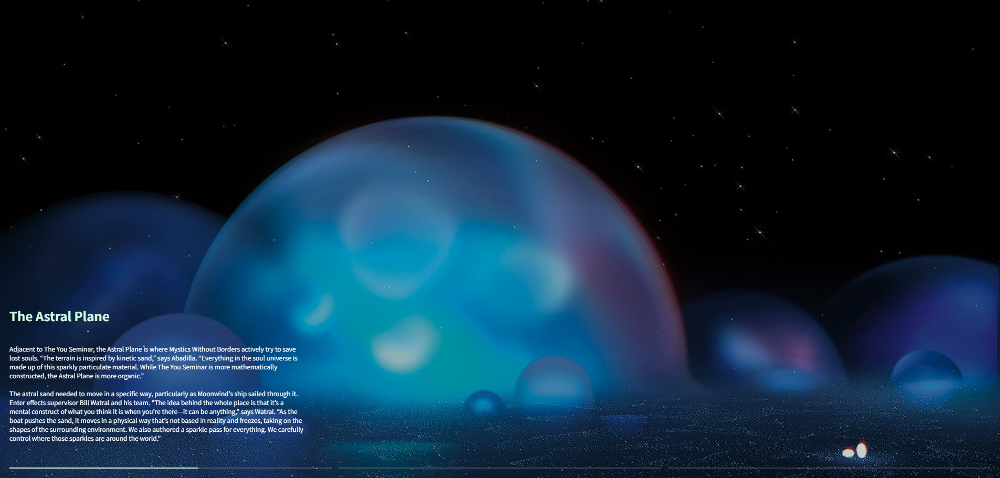

# 🪟 SVG Blind Reveal - Scroll Image Transition
 
> A scroll-driven image transition using SVG masks and horizontal blinds

<!-- 

 -->

[🔗 Live Demo](https://mask-scroll-transition.netlify.app/)

---

## Features
- **SVG Mask Transition**: Horizontal blind-style reveal effect using SVG mask strips
- **Scroll-driven Animation**: Image transitions triggered and scrubbed by scroll position
- **Caption Animation**: Clip-path based caption in/out animations per section
- **Progress Indicator**: Scroll progress bar synced to each section
- **Smooth Scrolling**: Lenis integration for fluid scroll experience

## Tech Stack
- **GSAP + ScrollTrigger** (scroll animations)
- **Lenis** (smooth scroll)
- **JavaScript (ES6+)**
- **SCSS**

## Credits
- Inspired by [Shape Slideshow with Clip Path](https://tympanus.net/codrops/2021/03/10/shape-slideshow-with-clip-path/) on Codrops.
